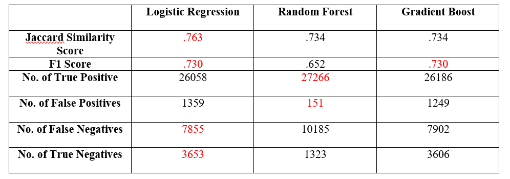

This project was completed for the IBM Data Science Capstone Project. The goal was to predict whether or not a car accident is a serious one based on the circumstances of the accident, for example, whether the driver was speeding or whether pedestrians were involved. Traffic accidents remain one of the largest causes of death and serious injury for Americans. In addition to the significant human cost, motorists and logistics companies alike face costly delays due to the impact of these serious crashes on traffic. Lane closures may be required for long periods of time to deal with the results of the accident, for example, to transport injured and/or clear accident wreckage. The goal is to predict the severity of a crash and in so doing, allow drivers to avoid the area, saving time for both motorists and logistics companies.  

## Data Acquisition and Cleaning  

The data used for the analysis was supplied by the Seattle Department of Transportation (SDOT) and consists of tabular data of 194,673 road collisions and their details from the Seattle, WA area collected between 01-01-2004 and 05-20-2020. The data includes location (lat, long, and address), type of collision, number involved (for persons, pedestrians, cyclists, and vehicles), incident date, whether the driver was inattentive, whether the driver was under the influence, and whether the driver was speeding, road conditions, weather conditions, and time of day. The dependent variable is a Boolean value indicating whether the accident was a serious one. 

I cleaned and formatted the data (e.g, removed duplicates, standardized boolean fields to 0/1, replaced null values with the modal column values where appropriate). I also removed data key fields and duplicated columns that were not relevant to the analysis.  

## Data Analysis  

After the data was cleaned, I began the analysis. First, I looked at type of collision.  

  

Some of the categories here, e.g., ‘Left Turn’, are disproportionately serious accidents. Others, such as ‘Sideswipe’ are disproportionately not serious. Certain others, e.g., ‘Pedestrian’ are more likely to be serious than others, but engaged in additional analysis on those categories (see below).  

The next data point reviewed was the SDOT_COLCODE feature. The SDOT_COLCODE feature maps to a SDOT_COLDESC feature that provides a human readable description of the description. For the ease of display, the SDOT_COLCODE feature is shown in the graph below, however I used SDOT_COLDESC in the model for greater explainability.  

  

The above graph shows that many of the description codes correlate with a particular accident severity, e.g., most type ‘0’ accidents are not serious.  

  

The number of pedestrians in a crash correlates pretty strongly with the likelihood of the accident being a serious one.  

  

Likewise, the number of cyclists in a crash correlates strongly with seriousness. Let’s look at speed.  

  

Accidents where speed was a factor seem to have a slightly higher chance of being serious than when speed isn’t a factor.  

  

Accidents where the driver was under the influence do seem to be disproportionately serious, but there aren’t a very large number of these relative to the whole. In the interests of space, I did not include the graph, but a similar distribution was seen for INATTENTIONIND.  

The most heavily correlated features with SEVERITYCODE were found to be COLLISIONTYPE, PEDCOUNT, PEDCYLCOUNT, and SDOT_COLCODE. Features that described the driver’s state at the time of the accident, e.g., UNDERINFL and INATTENTIONIND provided only a minor correlation.  

I felt pretty good about my initial assessment when I began to build my model. transformed the categorical data values into binary features using one-hot vector encoding for the ADDRTYPE, COLLISIONTYPE, SDOT_COLDESC, WEATHER, ROADCOND, and LIGHTCOND features. But then I found something curious. Some of the feature categories overlapped with other features. For example, there is a category within the COLLISIONTYPE column that relates to 'Parked Car' and a separate 'HITPARKEDCAR' feature. What to do?  

I investigated the top correlations between the various features to see if the number of features could be reduced. I noticed that some of the provided data columns have an overlap with categorical data in some of the other categories, e.g., there is both a ‘HITPARKEDCAR’ feature, as well as a category within the ‘COLLISIONTYPE’ for ‘Parked Car’.  Likewise, I was able to reduce some of the redundant features around the pedestrian and cyclist descriptors, keeping only the features that indicated the number of pedestrians and cyclists involved, PEDCOUNT and PEDCYLCOUNT respectively, as they correlated the most with SEVERITYCODE. In a similar fashion, I was able to reduce some category values for SDOT_COLDESC that correlated with features such as PEDCYLCOUNT.  

To get started building the model, I separated the dataset into a training and test dataset where the test data was a randomly selected 20% of the total.  

In terms of model, I chose between several classification algorithms. For a structured learning problem with an imbalanced dataset, I chose a few different algorithms to test: Logistic Regression, Random Forest, and Gradient Boost. I had begun with SVM as well, but each run of the SVM algorithm on the dataset took several hours to run and did not provide a performance improvement over any of the others. For Logistic Regression, I used a class-weight of .701 to reflect the imbalanced nature of the data toward the negative class, .701 being the proportion of data belonging to the negative class.  

## Model Performance  

I have included the Jaccard Similarity score for feature for informational purposes, however the key metric selected for the analysis is the F1-score. This is because the F1-score provides a much more robust evaluation of an imbalanced dataset in terms of precision and recall. The performance of the various models appears below.  

  

The logistic regression model performed best overall, with the highest F1-score (tied with Gradient Boost) and the best values for number of false negative/true negative. The Random Forest model had the lowest F1-score, but provided the highest number of true positives and lowest number of false positives. In this problem, we care more about the false negative rate, since the consequences of encountering (or being in) a serious car accident are inherently more significant than the consequences of a false positive (e.g., changing a route to avoid the accident).  

In sum, I analyzed the relationship between Seattle traffic accidents and details regarding the crash and the driver. I identified the number of pedestrians involved in the crash, the number of cyclists involved in the crash, and the type of collision as the most salient variables that predict the likelihood of a crash being a serious one. The models built can be valuable to motorists as well as logistics companies when it comes to driving strategy, as well as route selection in the event of encountering a crash (e.g., avoid the area if a cyclist was involved in the crash). Finally, the underlying data can serve as a reminder to drivers to pay closer attention to areas where the factors for a serious crash are likely to exist (e.g., where large numbers of pedestrians or cyclists are present).

